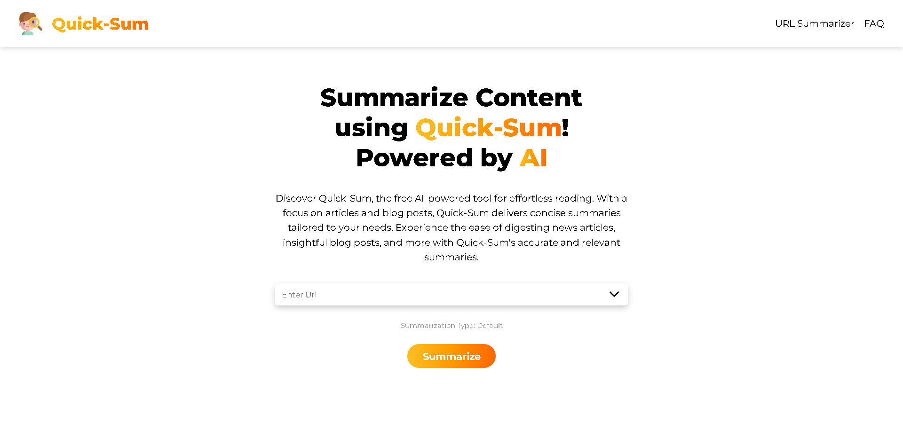

### **[Quick-Sum](https://quicksum-production.up.railway.app/)**

## **Project Introduction:**

Quick-Sum is a powerful and efficient full-stack application designed to transform the way you interact with digital content. Quick-Sum leverages cutting-edge technology to summarize articles and blog posts from any URL, making it easier than ever to extract the key points from an abundance of online content

Powered by the highly advanced OpenAI API, Quick-Sum understands and condenses text intelligently, preserving the context and essence of the original source. It's perfect for students, researchers, professionals, or anyone needing a quick understanding of long and potentially overwhelming articles or blog posts

## **About The Project:**

Quick-Sum is a full-stack URL summarization application optimized for summarizing articles and blog posts

The common functionalities are:

- The application accepts URLs of articles or blog posts to generate summaries. The URL should be valid and in the correct format
- A drop-down menu is provided for users to select their desired summarization type
- Quick-Sum provides three types of summarization: Default, Bullet Point, and Executive. These options cater to different user needs and preferences for content consumption
- When the "Summarize" button is clicked, Quick-Sum will verify the input URL and summarization type before sending a request to an external API for summarization
- The application incorporates error handling for common issues such as empty input field, invalid URL format, and issues with fetching the summarization
- In the FAQ section, users can find answers to common questions. Each question can be clicked to expand and display the answer. This can help users understand how to use Quick-Sum effectively and troubleshoot common issues

I'm using the [OpenAI API](https://openai.com/product) to get the summarization

Credit: OPENAI API

### **Built With:**

- React.js

- Node.js

- Express js

- JavaScript (ES6+)

- HTML/CSS

- Cheerio

- Puppeteer

### **Key Concepts:**

- Web Scraping

- Text Chunking

- Cors

- Axios

- Path

- Responsive Web Design

- API Consumption

- Component-based Architecture

- Summarization with AI
